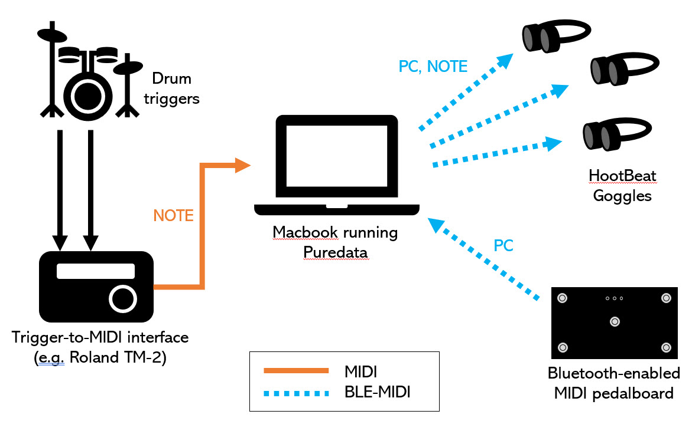
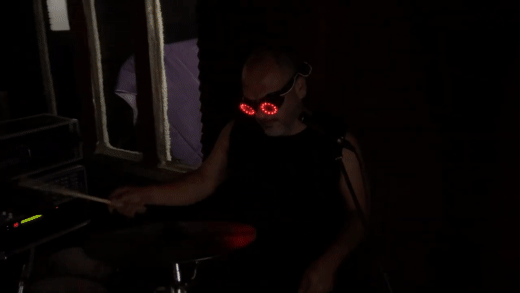
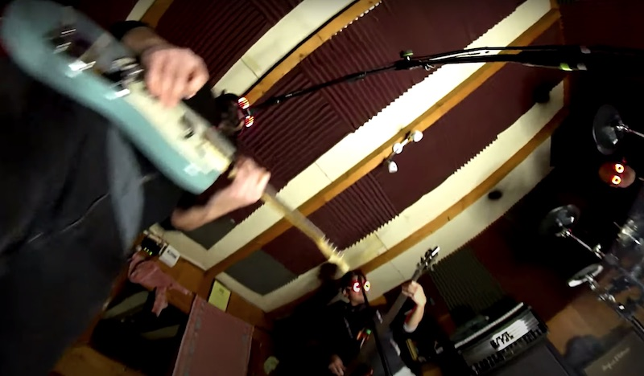

# HOOTBEAT

HootBeat features BLE-MIDI controlled wearable and ambient devices for interactive linghtening.
Great for enhancing an inviting participation of audience in live music performances.

## Block diagram

## Examples (images link to Youtube videos):

* [Drums demo](https://www.youtube.com/watch?v=fSSJu2f_Yg4):

* See them in action in [Spacebarman](http://www.spacebarman.com)'s music video [FOMO](https://www.youtube.com/watch?v=7elgfIqfh_I):

Directories:
- _Devices_. Arduino code for goggles and other devices. Also, in this directory is the _HootBeat_ library. To build devices, this library should be copied to the Arduino Library (Windows: `C:\Users\{username}\Documents\Arduino\Library` - macOS: `/Users/{username}/Documents/Arduino/Library` - Linux: `/home/{username}/Arduino/Library`)
- _Python-MIDI-util_. Requires python-rtmidi (https://spotlightkid.github.io/python-rtmidi/)
- _RaspberryPi-util_. Utilities to maintain BLE MIDI connections active

